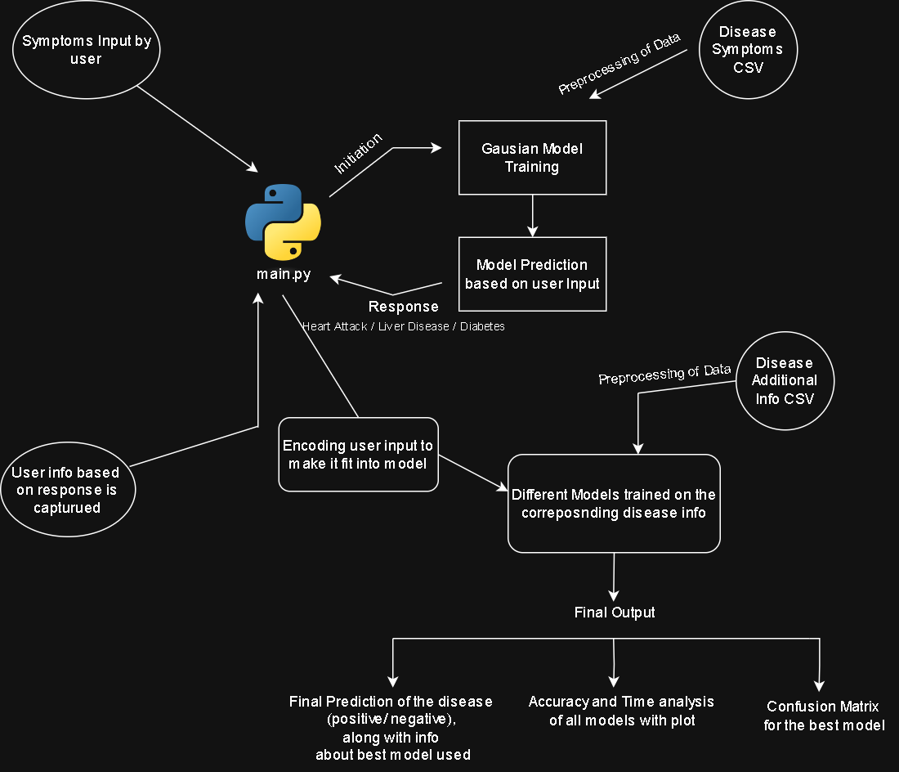

<h1>ML Learning Project - Supervised</h1>
<p>
    This project aim is to learn, understand and apply some basic supervised learning algorithms and comparing the models learning behaviour on different dataset.
</p>

<h2>Installation</h2>

1. Clone the repo

```bash
git clone git@github.com:mohitdixit02/ml_learning_project_supervised.git
```

2. Setup a python (>=3.13) virtual environment (Snippet for Windows)

```bash
cd ml_learning_project_supervised
python -m venv venv
```

3. Activate the environment and install the dependencies

```bash
.\venv\Scripts\activate
pip install -r requirements.txt
```

4. Run the main script

```bash
python main.py
```

<h3>Project workflow</h3>
<p>
    The project predicts the disease result (positive or negative) based on the symptoms and data provided by the user in two steps. workflow invloves:
    <ol>
    <li>Data selection and preprocessing: data selection, cleaning null values and preprocessing using services like MultiLabelBinarizer to encode multi-valued categorical columns.</li>
    <li>Model training: Data splitting and training the model using different supervised learning algorithms like Decision Tree, Random Forest, SVM, etc.</li>
    <li>Model evaluation: Evaluating the different model performances using metrics like accuracy and time for fitting</li>
    <li>Model prediction: Predicting the disease result based on the user input.</li>
    </ol>
</p>


<h4>- Thanks -</h4>
For any query, email at: mohit.vsht@gmail.com - Mohit Sharma
